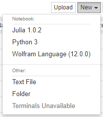
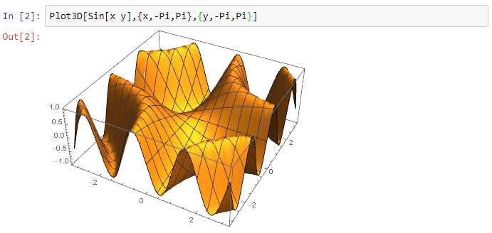
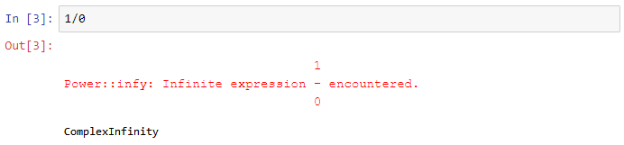

# Wolfram Language kernel for Jupyter notebooks

Jupyter provides a protocol (ZMQ) to connect their notebooks to various languages. This project defines a Wolfram Language kernel which can be used in Jupyter notebooks.

# Prerequisites

On your machine, you will need:

* Jupyter
* Wolfram Engine, i.e., a Wolfram Desktop or Mathematica installation
* Optional, but recommended: `wolframscript`

# Installation

There are **two** ways to make the Wolfram Language available in Jupyter:

* Using the `wolframscript` command line script interpreter
* Using Wolfram Language commands from the `WolframLanguageForJupyter` paclet.

## Method 1: Using `wolframscript`

On macOS/Unix: Clone the repository

	git clone https://github.com/WolframResearch/WolframLanguageForJupyter.git

Run the following command in your shell to make the Wolfram Language engine available to Jupyter:

	./configure-jupyter.wls add

On Windows: Follow the fist two steps [here](https://help.github.com/en/github/creating-cloning-and-archiving-repositories/cloning-a-repository), and on the the third step select `Download Zip`, and unzip the file using a tool for Windows. Open PowerShell in the directory of the unzipped folder

Run the following command in your shell to make the Wolfram Language engine available to Jupyter:

	.\configure-jupyter.wls add

**Notes:** 

* If the location of the Wolfram Engine changes, you will have to run `configure-jupyter.wls` again.

* `configure-jupyter.wls` gives an error if the Wolfram Engine could not be added.

For more configuration options run:

	./configure-jupyter.wls help

## Method 2: Using Wolfram Language

You can download the latest version of the paclet here:

https://github.com/WolframResearch/WolframLanguageForJupyter/releases

To install the paclet, run the following command with Wolfram Language (replacing x, y, and z with the correct values):

	PacletInstall["WolframLanguageForJupyter-x.y.z.paclet"]

To load the paclet, run:

	Needs["WolframLanguageForJupyter`"]

To add the Wolfram Language to Jupyter, run:

	ConfigureJupyter["Add"]

To specify a specific Jupyter binary, run:

	ConfigureJupyter["Add", "JupyterInstallation" -> "..."]

To specify a specific Wolfram Engine binary, run:

	ConfigureJupyter["Add", "WolframEngineBinary" -> "..." ]

Please note, however, that the value for the `"WolframEngineBinary"` option should not be a `wolframscript` path.

# Testing your installation

The following command should now list the Wolfram Engine:

	jupyter kernelspec list

The output should include a line like this:

	wolframlanguage12    C:\ProgramData\jupyter\kernels\wolframlanguage12

## To test your installation in a notebook, run the following command: 

	jupyter notebook

Then select Wolfram Language from the drop down menu:

After the In[] prompt you can now type a Wolfram Language command (use shift-enter to evaluate):

Outputs are either strings, for simple textual results, or images, for graphics and typeset results:

Any messages that occur during evaluation are displayed:

## To test your installation in the terminal, run the following command:
	jupyter-console --kernel=wolframlanguage12

# Building the WolframLanguageForJupyter paclet

To build the WolframLanguageForJupyter paclet file yourself, run:

	./configure-jupyter.wls build

This creates the `WolframLanguageForJupyter-x.y.z.paclet` file (use the `PacletInfo.m` to increment the version).

# Removing your installation

## Method 1: Using `wolframscript`

Run the following command to remove the Wolfram Language engine from Jupyter:

	./configure-jupyter.wls remove

## Method 2: Using Wolfram Language

Run the following command:

	ConfigureJupyter["Remove"]

# Links

* https://github.com/WolframResearch/WolframLanguageForJupyter
* https://jupyter.readthedocs.io/en/latest/projects/content-projects.html
